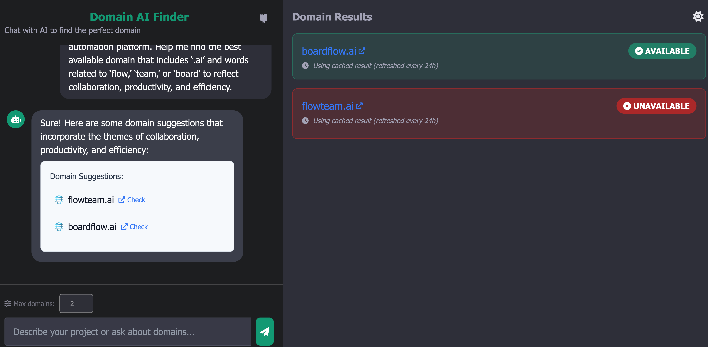

# Domain AI Finder

A smart domain name finder that leverages AI to suggest and check availability of domain names for your projects. Built with Node.js, Express, and OpenAI's GPT-4o.



## Features

- 🤖 **AI-Powered Suggestions** - Generate domain names based on project descriptions
- ✅ **Availability Checking** - Instantly check if domains are available
- 💾 **Caching System** - Save on API costs with 24-hour result caching
- 🔄 **Batch Domain Checking** - Check multiple domains at once
- 💬 **Chat Interface** - Conversational UI for domain exploration
- 🎨 **Dark/Light Mode** - Toggle between dark and light themes
- 📱 **Responsive Design** - Works on desktop and mobile devices
- 🧩 **Modular Architecture** - Clean separation of concerns for maintainability

## Installation

### Prerequisites

- Node.js (v18+)
- npm or yarn
- OpenAI API key (get from [platform.openai.com](https://platform.openai.com/api-keys))
- WHOIS XML API key (get from [whoisxmlapi.com](https://whoisxmlapi.com/))

### Setup

1. Clone the repository:
   ```bash
   git clone https://github.com/talkwaqar/ai-domain-suggester.git
   cd ai-domain-suggester
   ```

2. Install dependencies:
   ```bash
   npm install
   ```

3. Create a `.env` file based on the example:
   ```bash
   cp .env.example .env
   ```

4. Add your API keys to the `.env` file:
   ```
   OPENAI_API_KEY=your_openai_api_key
   WHOISXML_API_KEY=your_whoisxml_api_key
   ```

5. Start the development server:
   ```bash
   npm run dev
   ```

6. Open your browser and visit `http://localhost:3000`

## Usage

### Finding Domain Names

1. Enter a description of your project or business in the chat
2. The AI will suggest domain names based on your description
3. Available domains will be displayed at the top with green badges
4. Click "Check" next to any domain to open it in InstantDomainSearch

## Project Structure

The project uses a modular architecture for better maintainability:

### Backend Structure (`/src`)

```
src/
├── config/             # Configuration management
│   └── index.js        # Central configuration with environment variables
├── controllers/        # Request handlers
│   └── chatController.js # Chat endpoint controller
├── middleware/         # Express middleware
│   ├── cors.js         # CORS handling
│   └── errorHandler.js # Global error handling
├── routes/             # API route definitions
│   └── chatRoutes.js   # Chat endpoint routes
├── services/           # Business logic
│   ├── ai/             # AI service for domain suggestions
│   │   └── aiService.js # OpenAI integration
│   └── domain/         # Domain availability checking service
│       └── domainService.js # WhoisXML API integration and caching
└── utils/              # Utility functions
```

### Frontend Structure (`/public/javascripts`)

```
public/javascripts/
├── main.js            # Main entry point
└── modules/
    ├── api.js         # API communication
    ├── app.js         # Application controller
    ├── storage.js     # Local storage management
    ├── theme.js       # Theme management
    └── ui.js          # UI components and rendering
```

For more details on the backend structure, see [src/README.md](src/README.md).

## Configuration

The application is configured using environment variables. Copy `.env.example` to `.env` and customize:

### Server Configuration

| Variable | Description | Default |
|----------|-------------|---------|
| `PORT` | Port to run the server | `3000` |
| `NODE_ENV` | Environment mode (development, production) | `development` |

### OpenAI Configuration

| Variable | Description | Default |
|----------|-------------|---------|
| `OPENAI_API_KEY` | Your OpenAI API key | Required |
| `OPENAI_MODEL` | AI model to use for suggestions | `gpt-4o` |
| `OPENAI_TEMPERATURE` | Randomness of AI responses (0.0-1.0) | `0.7` |

### Domain API Configuration

| Variable | Description | Default |
|----------|-------------|---------|
| `WHOISXML_API_KEY` | Your WHOIS XML API key | Required |

## API Endpoints

| Endpoint | Method | Description | Request Body |
|----------|--------|-------------|-------------|
| `/api/chat` | POST | Process chat messages and generate domain suggestions | `{ messages: Array, lastResults: Array, limit: Number }` |

### Request Format

```json
{
  "messages": [
    {"role": "user", "content": "I need a domain for my new tech startup"},
    {"role": "assistant", "content": "previous AI response..."}
  ],
  "lastResults": [
    {"domain": "example.com", "available": false, "status": "UNAVAILABLE"},
    {"domain": "example.ai", "available": true, "status": "AVAILABLE"}
  ],
  "limit": 5
}
```

### Response Format

```json
{
  "message": "Here are some domain suggestions for your tech startup...",
  "domains": {
    "results": [
      {"domain": "techstartup.ai", "available": true, "status": "AVAILABLE"},
      {"domain": "startuptech.com", "available": false, "status": "UNAVAILABLE"}
    ]
  }
}
```

## Development

This project includes several npm scripts to make development easier:

- `npm start` - Start the server
- `npm run dev` - Start the server with auto-restart on file changes (using nodemon)
- `npm run debug` - Start the server with debug logging

## Contributing

Contributions are welcome! Please feel free to submit a Pull Request.

1. Fork the repository
2. Create your feature branch (`git checkout -b feature/amazing-feature`)
3. Commit your changes (`git commit -m 'Add some amazing feature'`)
4. Push to the branch (`git push origin feature/amazing-feature`)
5. Open a Pull Request

## License

This project is licensed under the MIT License - see the [LICENSE](LICENSE) file for details.

## Author

**Waqar Ghaffar** - [waqar@tplex.com](mailto:waqar@tplex.com)

## Acknowledgments

- OpenAI for the GPT-4o API
- WHOIS XML API for domain availability checking
- All contributors and supporters of the project 